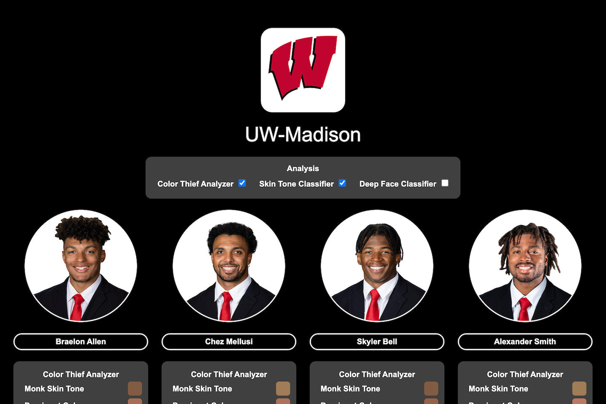
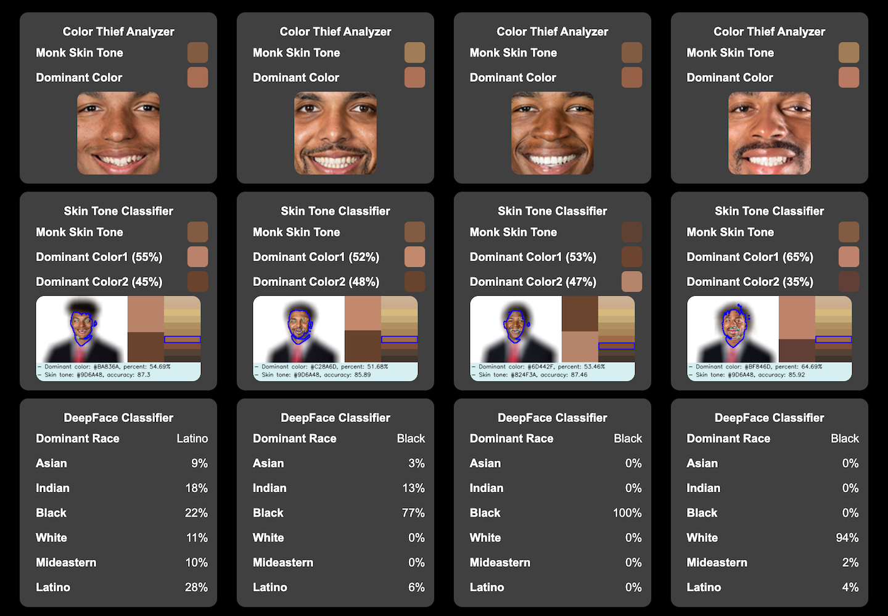

  

     
  

# NCAA Athlete Data

The NCAA Athlete Data is a dataset classifying NCAA athletes by skin tone using various image  classifiers.

Wisconsin Badgers

Sample Results

<!-- CONTACT -->
## Acknowledgements
This software was made possible by the following organizations:

1. [University of Wisconsin](http://wisc.edu) [School of Business](http://business.wisc.edu)

1. [University of Wisconsin](http://wisc.edu) [Data Science Institute](http://datascience.wisc.edu)

2. [ESPN](http://espn.com)

Thank you to ESPN for providing access to their data through their API.  This software was created without involvement from or any association with the ESPN organization.

<!-- CONTACT -->
## Contact

Abe Megahed - (mailto:amegahed@wisc.edu)
